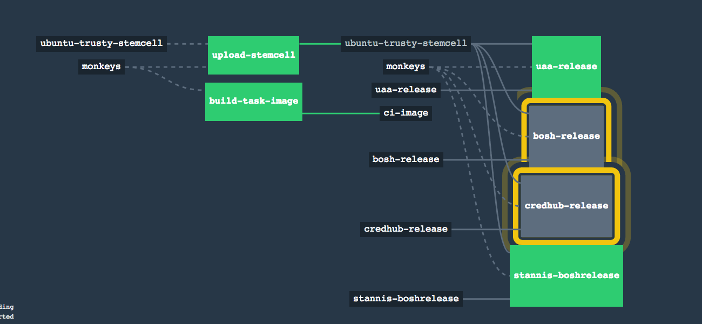

# Million Monkeys

Compile all community BOSH releases against the latest stemcell.

Primarily this project describes a large Concourse CI pipeline.

Whenever a new stemcell is published, all community BOSH releases are deployed; then their compiled packages are exported.

[](https://ci.starkandwayne.com/teams/main/pipelines/million-monkeys)

* [CI pipeline in action](https://ci.starkandwayne.com/teams/main/pipelines/million-monkeys)

## Usage

Get YAML snippets that you can merge into your deployment manifests:

```
$ ./bin/monkeys bosh
---
releases:
- name: bosh
  version: 261.4
  sha1: a4c648d0fcc6c818cb35ba7aead6a4d9ddb32826
  url: https://s3.amazonaws.com/million-monkeys-releases/cloudfoundry/bosh-261.4-ubuntu-trusty-3363.12.tgz
```

To get a `bosh-cli int -o` operator patch file format:

```
$ ./bin/monkeys bosh patch
- type: replace
  path: /releases/name=bosh?
  value:
    name: bosh
    version: 261.4
    sha1: a4c648d0fcc6c818cb35ba7aead6a4d9ddb32826
    url: https://s3.amazonaws.com/million-monkeys-releases/cloudfoundry/bosh-261.4-ubuntu-trusty-3363.12.tgz
```

To see the list of available pre-compiled releases:

```
$ ./bin/monkeys
USAGE: ./bin/monkeys [release] [spruce|patch]
  where 'release' can be any of:
  * bosh-warden-cpi-release
  * bosh
  * cf-release
  * credhub-release
  ...
```


A sample use case for `bosh-cli create-env` or `bosh-cli int`:

```
bosh-cli int bosh.yml \
  -o <(curl -s https://s3.amazonaws.com/million-monkeys-releases-latest/cloudfoundry/bosh-latest.patch.yml)
  -o vsphere/cpi.yml
  -o <(curl -s https://s3.amazonaws.com/million-monkeys-releases-latest/stemcell-vsphere-esxi.patch.yml)
```

This is patching in the latest bosh & vsphere-esxi stemcell combination.

Another is with `spruce merge`:

```
spruce merge bosh.yml
  <(curl -s https://s3.amazonaws.com/million-monkeys-releases-latest/cloudfoundry/bosh-latest.spruce.yml)
  <(curl -s https://s3.amazonaws.com/million-monkeys-releases-latest/stemcell-vsphere-esxi.spruce.yml)
```

Note the slight differences in the suffix above: `.spruce.yml` vs `.patch.yml`.

Currently supported stemcells are (to replace `vsphere-esxi` in examples above):

* `vsphere-esxi`
* `warden-boshlite`
* `aws-xen-hvm`
* `azure-hyperv`
* `google-kvm`
* `openstack-kvm`

For example, for the latest light AWS stemcell:

```
curl -s https://s3.amazonaws.com/million-monkeys-releases-latest/stemcell-aws-xen-hvm.spruce.yml
```

The output might be similar to:

```yaml
---
resource_pools:
- name: vms
  stemcell:
    name: bosh-aws-xen-hvm-ubuntu-trusty-go_agent
    sha1: 3f4251c27a1173812199ae6301dc968660d8ae8b
    url: https://bosh.io/d/stemcells/bosh-aws-xen-hvm-ubuntu-trusty-go_agent?v=3363.12
    version: "3363.12"
```

And more importantly, lots of skipping package compilation:

```yaml
Compiling package 'ruby/c1086875b047d112e46756dcb63d8f19e63b3ac4'... Skipped [Package already compiled] (00:01:54)
Compiling package 'mysql/b7e73acc0bfe05f1c6cbfd97bf92d39b0d3155d5'... Skipped [Package already compiled] (00:01:28)
Compiling package 'libpq/661f5817afe24fa2f18946d2757bff63246b1d0d'... Skipped [Package already compiled] (00:00:10)
```

## Add new release

Create a file in `releases/`.

If the release is on https://bosh.io/releases then simply run:

```yaml
./ci/add-bosh-io-release.sh cloudfoundry-community/your-boshrelease
```

If the release is available as a `tgz` attachment to a GitHub release, then create the following `releases/your-boshrelease.yml` file:

```yaml
---
release:
  release_label: credhub-release
  release_org_name: pivotal-cf/credhub-release

resources:
- name: (( grab release.release_label ))
  type: github-release
  source:
    user: pivotal-cf
    repository: (( grab release.release_label ))
    access_token: (( grab meta.github.token ))
    pre_release: true
```

In the example above, at the time https://pivotal-cf/credhub-release/releases were tagged "pre-release", so `pre_release: true` is set.

Submit a PR, and the additional release will be generated into the pipeline soon.

## Updating pipeline

After merging PRs, update the pipeline with:

```
./ci/repipe.yml
```

## Thanks

Thanks as always to the BOSH core team for the last five years of work. So many people have contributed to BOSH. Thanks to Pivotal, IBM, VMWare and other companies for funding its development.

I found the `export-release.sh` script in the https://github.com/cloudfoundry/bosh CI tasks. I didn't know you could deploy a manifest with an empty `instance_groups`. That makes it possible to compile the packages of any arbitrary BOSH release without knowing anything about it (required properties etc).
